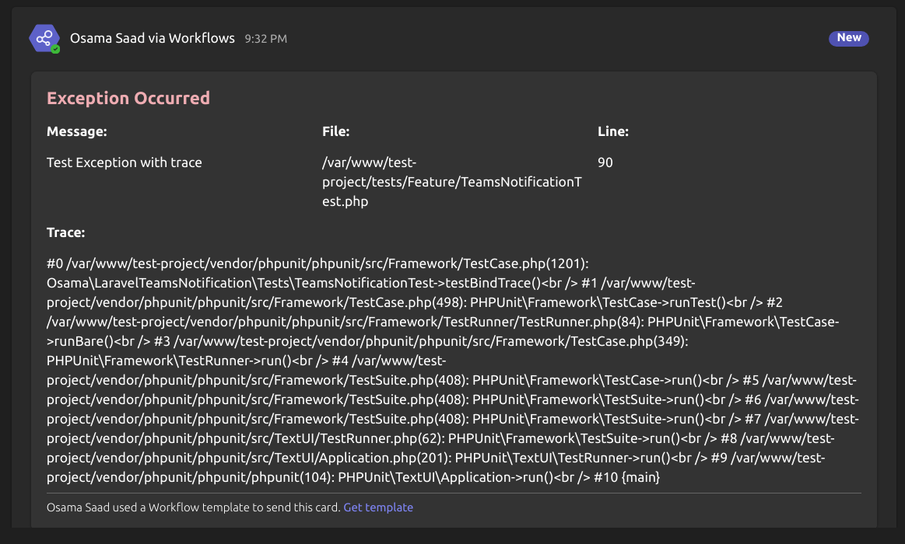
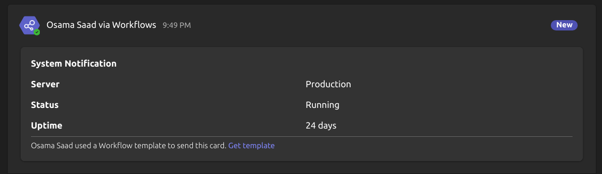
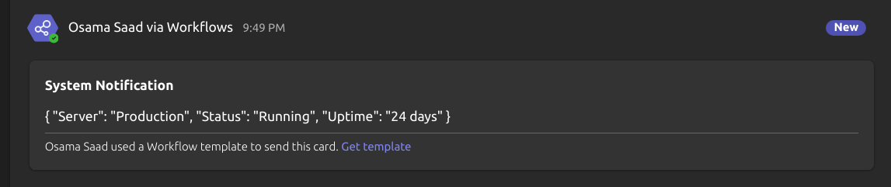

# Laravel Teams Notification

Laravel Teams Notification is a package to send notifications to Microsoft Teams using an incoming webhook URL. This package supports sending normal messages, exception messages with trace, and messages with additional details or JSON blocks.





## Installation

To install the package, use Composer:

```bash
composer require osa-eg/laravel-teams-notification
```

Then, add your Microsoft Teams webhook URL to your `.env` file:

```env
TEAMS_WEBHOOK_URL=your_teams_webhook_url
```
## Publishing Files
### Config

To publish the config file included with this package to your Laravel project, run:

```bash
php artisan vendor:publish --tag=laravel-teams-notification-config
````


## Usage

### Sending a Normal Message

To send a normal message, use the `sendMessage` method:

```php
use Osama\LaravelTeamsNotification\TeamsNotification;

$notification = new TeamsNotification();
$message = "System Notification";
$notification->sendMessage($message);
```

### Sending a Normal Message with Additional Details and Color

To send a normal message with additional details, use the `sendMessage` method with the second parameter:

```php
use Osama\LaravelTeamsNotification\TeamsNotification;

$notification = new TeamsNotification();
$message = "System Notification";
$details = [
    'Server' => 'Production',
    'Status' => 'Running',
    'Uptime' => '24 days'
];
$notification->sendMessage($message, $details);
```

### Sending a Success Message

To send a success message, use the `success` method:

```php
use Osama\LaravelTeamsNotification\TeamsNotification;

$notification = new TeamsNotification();
$message = "Operation completed successfully!";
$details = [
    'Duration' => '2 seconds',
    'Processed Items' => '150'
];
$notification->success()->sendMessage($message, $details);
```

### Sending a Warning Message

To send a warning message, use the `warning` method:

```php
use Osama\LaravelTeamsNotification\TeamsNotification;

$notification = new TeamsNotification();
$message = "Warning: High Memory Usage Detected";
$details = [
    'Memory Usage' => '95%',
    'Server' => 'Production'
];
$notification->warning()->sendMessage($message, $details);
```

### Sending an Error Message with Trace and Default Attention Color

To send an error message with trace, use the `error` method and `bindTrace` method:

```php
use Osama\LaravelTeamsNotification\TeamsNotification;

try {
    // Code that may throw an exception
} catch (\Exception $exception) {
    $notification = new TeamsNotification();
    $notification->bindTrace()->error()->sendException($exception);
}
```

### Sending a Message with Array as JSON Block and Custom Color

To send a message with an array as a JSON block, use the `sendJsonMessage` method:

```php
use Osama\LaravelTeamsNotification\TeamsNotification;

$notification = new TeamsNotification();
$message = "Data Update";
$data = [
    'user_id' => 12345,
    'action' => 'update',
    'status' => 'success',
    'timestamp' => date('Y-m-d H:i:s')
];
$notification->success()->sendJsonMessage($message, $data);
```

## Methods

- **setColor(string $color)**: Sets the color of the message. Valid colors are "default", "dark", "light", "accent", "good", "warning", "attention".
- **success()**: Sets the message color to "good".
- **warning()**: Sets the message color to "warning".
- **error()**: Sets the message color to "attention".
- **sendMessage($message, array $details = [])**: Sends a normal message with additional details.
- **sendException(\Exception $exception)**: Sends an exception message with optional trace details.
- **bindTrace()**: Includes the trace in the exception message.
- **sendJsonMessage($message, array $data)**: Sends a message with an array as a JSON block.

## License

This package is open-sourced software licensed under the [MIT license](LICENSE).
```

This README file now includes instructions and examples for using the enhanced features of the `TeamsNotification` package, including setting message colors, sending success, warning, and error messages, and sending messages with JSON blocks.