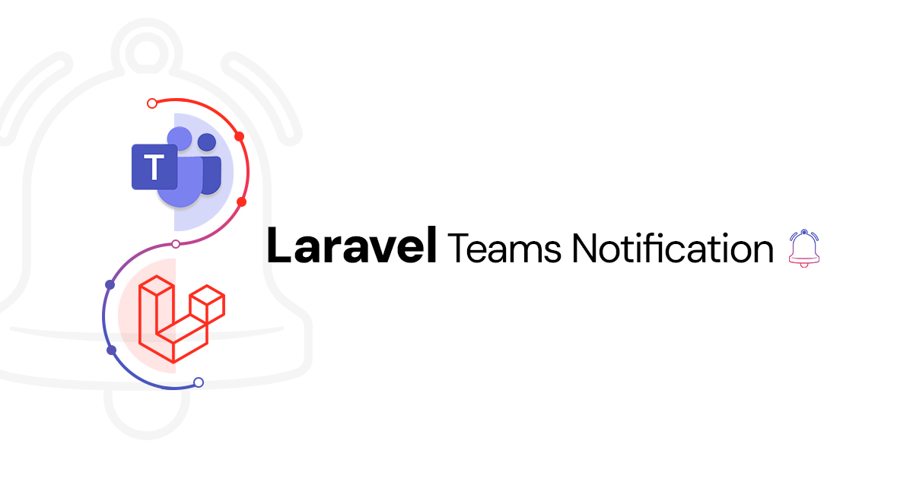

# Laravel Teams Notification

Laravel Teams Notification is a package for sending notifications to Microsoft Teams using the "Post to a channel when a webhook request is received" workflow webhook. It supports sending normal messages, exception messages with trace, and messages with additional details or JSON blocks, following the JSON structure required by Microsoft Teams adaptive cards. The package also includes custom logging functionality for Laravel, making it easy to integrate with your existing Laravel applications and log important events directly to Microsoft Teams channels.

<!-- Full-width image -->
<p align="center">
  
</p>


## Table of Contents

- [Features](#features)
- [Installation](#installation)
- [Publishing Files](#publishing-files)
  - [Config](#config)
- [Usage](#usage)
  - [Sending a Normal Message](#sending-a-normal-message)
  - [Sending a Normal Message with Additional Details and Color](#sending-a-normal-message-with-additional-details-and-color)
  - [Sending a Success Message](#sending-a-success-message)
  - [Sending a Warning Message](#sending-a-warning-message)
  - [Sending an Error Message with Trace and Default Attention Color](#sending-an-error-message-with-trace-and-default-attention-color)
  - [Sending a Message with Array as JSON Block and Custom Color](#sending-a-message-with-array-as-json-block-and-custom-color)
- [Custom Logging](#custom-logging)
- [Methods](#methods)
- [Learn More](#Learn-More)
- [License](#license)

## Features

- **Send Normal Messages**: Send simple text notifications to Teams.
- **Send Messages with Additional Details**: Include extra details in the notification.
- **Send Success Messages**: Highlight successful operations with a green color.
- **Send Warning Messages**: Indicate warnings with an orange color.
- **Send Error Messages**: Report errors with a red color and optional stack trace.
- **Send Messages with JSON Blocks**: Include formatted JSON data in the message.
- **Custom Logging**: Log messages directly to Microsoft Teams using Laravel’s logging system.
- **Configurable Message Colors**: Set custom colors for messages with predefined options.

## Installation

To install the package, you need PHP 7.0 or higher and Laravel 5.5 or later. Use Composer:

```bash
composer require osa-eg/laravel-teams-notification
```


Then, add your Microsoft Teams webhook URL to your `.env` file:

```env
TEAMS_WEBHOOK_URL=your_teams_webhook_url
```

## Publishing Files

### Config

To publish the config file included with this package to your Laravel project, run:

```bash
php artisan vendor:publish --tag=laravel-teams-notification-config
```

## Usage

### Sending a Normal Message

To send a normal message, use the `sendMessage` method:

```php
use Osama\LaravelTeamsNotification\TeamsNotification;

$notification = new TeamsNotification();
$message = "System Notification";
$notification->sendMessage($message);
```

### Sending a Normal Message with Additional Details and Color

To send a normal message with additional details, use the `sendMessage` method with the second parameter:

```php
use Osama\LaravelTeamsNotification\TeamsNotification;

$notification = new TeamsNotification();
$message = "System Notification";
$details = [
    'Server' => 'Production',
    'Status' => 'Running',
    'Uptime' => '24 days'
];
$notification->sendMessage($message, $details);
```

### Sending a Success Message

To send a success message, use the `success` method:

```php
use Osama\LaravelTeamsNotification\TeamsNotification;

$notification = new TeamsNotification();
$message = "Operation completed successfully!";
$details = [
    'Duration' => '2 seconds',
    'Processed Items' => '150'
];
$notification->success()->sendMessage($message, $details);
```

### Sending a Warning Message

To send a warning message, use the `warning` method:

```php
use Osama\LaravelTeamsNotification\TeamsNotification;

$notification = new TeamsNotification();
$message = "Warning: High Memory Usage Detected";
$details = [
    'Memory Usage' => '95%',
    'Server' => 'Production'
];
$notification->warning()->sendMessage($message, $details);
```

### Sending an Error Message with Trace and Default Attention Color

To send an error message with trace, use the `error` method and `bindTrace` method:

```php
use Osama\LaravelTeamsNotification\TeamsNotification;

try {
    // Code that may throw an exception
} catch (\Exception $exception) {
    $notification = new TeamsNotification();
    $notification->bindTrace()->error()->sendException($exception);
}
```

### Sending a Message with Array as JSON Block and Custom Color

To send a message with an array as a JSON block, use the `sendJsonMessage` method:

```php
use Osama\LaravelTeamsNotification\TeamsNotification;

$notification = new TeamsNotification();
$message = "Data Update";
$data = [
    'user_id' => 12345,
    'action' => 'update',
    'status' => 'success',
    'timestamp' => date('Y-m-d H:i:s')
];
$notification->success()->sendJsonMessage($message, $data);
```

## Custom Logging

The package also supports custom logging to Microsoft Teams. To set up custom logging, follow these steps:

1. **Configure Logging in Your Laravel Project:**

   In `config/logging.php`, add the following configuration:

   ```php
   'channels' => [
       // Other channels...

       'teams' => [
           'driver' => 'custom',
            'via' => \Osama\LaravelTeamsNotification\Logging\TeamsLoggingChannel::class,
            'webhook_url' => env('TEAMS_WEBHOOK_URL'),
        ],
   ```

2. **Use the Custom Log Channel:**

   To log messages to Teams, use the `teams` log channel:

   ```php
   Log::channel('teams')->info('This is an info message');
   Log::channel('teams')->error('This is an error message');
   ```

## Methods

- **setColor(string $color)**: Sets the color of the message. Valid colors are "default", "dark", "light", "accent", "good", "warning", "attention".
- **success()**: Sets the message color to "good".
- **warning()**: Sets the message color to "warning".
- **error()**: Sets the message color to "attention".
- **sendMessage($message, array $details = [])**: Sends a normal message with additional details.
- **sendException(\Exception $exception)**: Sends an exception message with optional trace details.
- **bindTrace()**: Includes the trace in the exception message.
- **sendJsonMessage($message, array $data)**: Sends a message with an array as a JSON block.

## Learn More

For a detailed guide on integrating Microsoft Teams notifications with your Laravel application, check out my Medium article:

[Streamlining Laravel Notifications with Microsoft Teams Workflow Integration](https://medium.com/@osama.96.eg/streamlining-laravel-notifications-with-microsoft-teams-workflow-integration-99b0e52cafe4)


## License

This package is open-sourced software licensed under the [MIT license](LICENSE).
```

This README now includes a Table of Contents section that links to different parts of the document for easier navigation.